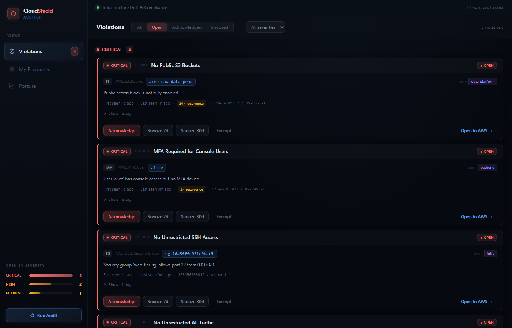
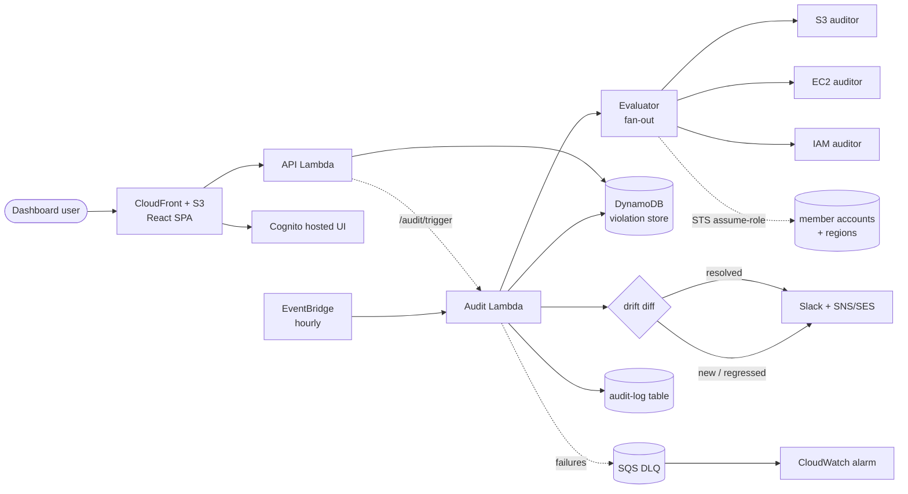

# CloudShield-Auditor

Serverless AWS CSPM that continuously audits your accounts against security policies and tracks every finding through its full lifecycle.


<!-- Once pushed to GitHub, wire up the live CI badge:
 -->



**Highlights**

- **Continuous auditing.** An hourly EventBridge schedule runs the rule set against live cloud state. No manual scans.
- **Alert de-noising.** You only hear about drift that is genuinely new. Already-tracked findings update silently, so the channel stays signal.
- **Full violation lifecycle.** Every finding moves through acknowledge / snooze / exempt / resolve, with an append-only audit trail of who changed what and when.
- **Multi-account coverage.** A central auditor account assumes read-only roles into member accounts and scans them, tagging each finding with its account and region.

## What it does

Most CSPM clones list findings. The value here is the operating model around them.

Every violation has a deterministic identity: the same misconfiguration keeps one ID (`uuid5` of `rule_id#resource_id`) across every run, so re-detections increment an occurrence count instead of spawning duplicates. The auditor diffs each run against the previous state, which is what lets it tell three situations apart that a naive scanner conflates: a brand-new finding fires an alert, a finding that was resolved and has now reappeared re-alerts (a regression), and a still-failing finding you deliberately exempted stays quiet. That distinction, plus snooze timers that auto-expire and reopen, is the difference between scanning a cloud and operating a security program on it.

## Architecture



**One audit cycle, in order.** The Lambda wakes any snoozed findings whose timer has expired and flips them back to open. It snapshots the set of currently-active findings. It runs every rule against freshly-fetched cloud state. It upserts each result with conditional writes (so a scheduled run and a manual trigger can't corrupt each other). It diffs the results against the pre-run snapshot to label findings as newly-appeared versus resolved. Finally it alerts only on the new ones and posts a count of the resolved ones.

## Design decisions and tradeoffs

**Idempotent, atomic writes.** Problem: the hourly schedule and a manual `/audit/trigger` can run concurrently, and a read-then-write upsert would let them clobber each other's occurrence counts or double-alert. Decision: a three-phase conditional write. Phase 1 attempts a create gated on `attribute_not_exists(pk)`. Phase 2 (on a hit) does a status-gated update that bumps `last_seen`/`occurrence_count`. Phase 3 only overwrites when the existing item is `RESOLVED`, which is the regression case. Tradeoff: three round trips in the worst case instead of one, in exchange for correctness under concurrency with no locks.

**Sparse, write-sharded active index.** Problem: queries like "all open findings" shouldn't scan the table, but a GSI keyed on a status with ~3 values creates a hot partition where every open item lands on one key. Decision: the `active-pk-index` carries the key `STATUS#shard`, where `shard = crc32(pk) % N` (default 10), and the key is dropped entirely on resolve/exempt. So the index is both sparse (resolved history never bloats it) and spread across N partitions per status. Tradeoff: reads fan out across the shards and merge, and N is fixed at deploy (changing it needs a re-shard), in exchange for removing the single-partition write ceiling.

**Alert de-noising.** Problem: a CSPM that re-alerts every finding every hour trains people to ignore it. Decision: alerts fire only on findings that are net-new relative to the pre-run snapshot. Tradeoff: the alert path depends on the persisted store being correct, which is why the write path above is conditional rather than best-effort.

**Cross-account via STS assume-role.** Problem: covering an org. Decision: one central auditor account assumes a read-only role in each member account rather than deploying the whole stack everywhere. Tradeoff: a small amount of per-account setup (one role) against a single place to operate, patch, and pay for.

**Its own posture.** Secrets live in Secrets Manager and are read at cold start, never injected into Lambda environment variables. Deploys use GitHub OIDC with no static AWS keys. Both are called out here because this is a security tool, and holding it to the standard it enforces is part of the story.

## Security of the tool itself

- **Least-privilege IAM.** The auditor's execution role is read-only against the services it inspects; the cross-account role is read-only too.
- **Private dashboard origin.** The dashboard bucket blocks all public access; CloudFront reaches it through an Origin Access Control, so the bucket is never directly reachable.
- **Authenticated API.** Cognito JWT (validated for signature, issuer, and `token_use`) for the dashboard, plus a constant-time API-key path for machine-to-machine callers.
- **Signed Slack callbacks.** The interactivity endpoint verifies the Slack request signature and rejects anything outside a 5-minute replay window.
- **No silent failures.** Every Lambda and schedule has an SQS dead-letter queue, and a CloudWatch alarm fires to SNS the moment a message lands in it.

## Policy catalog

| ID | Service | Severity | Checks |
|---|---|---|---|
| S3_001 | S3 | CRITICAL | All four PublicAccessBlock settings enabled |
| S3_002 | S3 | HIGH | Default server-side encryption configured |
| S3_003 | S3 | MEDIUM | Versioning enabled |
| S3_004 | S3 | CRITICAL | Bucket policy does not grant `Principal: "*"` |
| IAM_001 | IAM | CRITICAL | Console users have an MFA device |
| IAM_002 | IAM | HIGH | Access keys rotated within 90 days |
| IAM_003 | IAM | HIGH | Account password policy meets complexity rules |
| IAM_004 | IAM | CRITICAL | Root account has MFA enabled |
| EC2_001 | EC2 | CRITICAL | No SG allows SSH (22) from 0.0.0.0/0 |
| EC2_002 | EC2 | CRITICAL | No SG allows RDP (3389) from 0.0.0.0/0 |
| EC2_003 | EC2 | CRITICAL | No SG allows all traffic from any source |
| EC2_004 | EC2 | MEDIUM | No SG allows HTTP (80) from 0.0.0.0/0 |

Rules are declared in `policies.yaml`. Adding one is two steps: add the YAML entry (id, name, severity, `check`), then implement that `check` handler in the relevant auditor. The auditors follow a small strategy interface (`fetch_resources` + `evaluate`), so a new service is a new class, not a change to the engine.

```yaml
# policies.yaml
- id: S3_002
  name: "S3 default encryption required"
  severity: HIGH
  check: encryption_disabled
```

## Deployment

**Prerequisites:** an AWS account, the AWS SAM CLI, and Node 18+ for the dashboard build.

```bash
# 1. One-time per account: deploy the OIDC trust stack so CI can assume a deploy role
make bootstrap GITHUB_ORG=your-org-name

# 2. Build and deploy the application stack (guided the first time, saves samconfig.toml)
make deploy-guided SLACK_WEBHOOK_URL=https://hooks.slack.com/...

# 3. Build and publish the dashboard (reads API + Cognito config from stack outputs)
make dashboard-deploy
```

After the first deploy, populate the secret if you didn't pass it as a parameter, and set your scan targets:

```bash
aws secretsmanager put-secret-value \
  --secret-id /cloudshield/production/secrets \
  --secret-string '{"slack_webhook_url":"...","api_key":"...","slack_signing_secret":"..."}'
```

**Cross-account scanning.** This is the step people get stuck on, so it's spelled out. Each account you want scanned must host a read-only role that trusts the central account. Deploy `member-account-role.yaml` into every member account (a CloudFormation StackSet across the org is the clean way), then list the targets in the `AuditTargetAccounts` parameter:

```json
[
  {"account_id": "111122223333", "region": "us-east-1", "role_arn": "arn:aws:iam::111122223333:role/CloudShieldAuditRole"},
  {"account_id": "444455556666", "region": "eu-west-1", "role_arn": "arn:aws:iam::444455556666:role/CloudShieldAuditRole"}
]
```

With no targets set, the auditor scans its own account and region.

### CloudFormation parameters

| Parameter | Default | Purpose |
|---|---|---|
| `SlackWebhookUrl` | _(NoEcho)_ | Incoming webhook for Block Kit alerts. Seeds the secret on first deploy. |
| `ApiKey` | _(empty)_ | Pre-shared key for the `X-Api-Key` machine-to-machine path. |
| `SlackSigningSecret` | _(empty)_ | Verifies Slack interactivity callbacks. |
| `AuditTargetAccounts` | `[]` | JSON array of cross-account scan targets. |
| `DigestToEmail` | _(empty)_ | Enables the weekly SES digest to this address. |
| `DigestFromEmail` | `cloudshield-noreply@example.com` | Verified SES sender. |
| `AuditScheduleExpression` | `rate(1 hour)` | How often the auditor runs. |
| `Environment` | `production` | Suffix applied to all resource names. |

CI/CD: a push to `main` lints, runs the test suite, then deploys via OIDC. No static keys live in GitHub secrets. See `.github/workflows/deploy.yml`.

## Local development and testing

```bash
pip install -r requirements-dev.txt
make test         # 104 tests, Moto-backed (no real AWS)
make lint         # ruff
make type-check   # mypy

python scripts/local_run.py   # simulate a full audit cycle against mocked AWS

cd dashboard && npm install && npm run dev   # http://localhost:5173
```

The dashboard runs against an in-memory mock API by default, so no backend is needed to explore it. Auth is a no-op when the Cognito environment variables are unset, so the SPA loads straight to the dashboard locally.

The suite is part of the trust story, not an afterthought. It covers the violation lifecycle (including the regression and exempted-survives-reaudit edge cases), the JWT verification branches (valid id/access tokens, expired, wrong client, wrong issuer, key rotation), the Secrets Manager loader and its env fallback, write-sharding behavior, and the multi-account evaluator including assume-role failure isolation.

## Configuration reference

Secrets come from Secrets Manager (via `SECRETS_ARN`). Everything below is non-secret runtime config.

| Variable | Set on | Purpose |
|---|---|---|
| `VIOLATIONS_TABLE` | all | DynamoDB violation store |
| `AUDIT_LOG_TABLE` | all | Append-only lifecycle trail |
| `SECRETS_ARN` | all | Secrets Manager secret to read at cold start |
| `SNS_TOPIC_ARN` | all | Alert + alarm fan-out topic |
| `DASHBOARD_URL` | all | CloudFront URL (Slack deep links, CORS allow-list) |
| `AUDIT_TARGETS` | auditor | JSON cross-account targets (mirrors the parameter) |
| `ACTIVE_PK_SHARDS` | auditor/api | Shard count for the active index (default 10, fixed at deploy) |
| `AUDITOR_FUNCTION_NAME` | api | Target for the async `/audit/trigger` invoke |
| `COGNITO_ISSUER`, `COGNITO_CLIENT_ID` | api | JWT validation |
| `DIGEST_TO_EMAIL`, `DIGEST_FROM_EMAIL` | digest | Weekly SES summary |

## Project layout

```
src/
  auditors/       strategy base + s3/ec2/iam auditors (fetch_resources + evaluate)
  engine/         evaluator.py: multi-account/region fan-out
  store/          violations.py (lifecycle + sharded writes), audit_log.py (trail)
  config/         secrets.py: Secrets Manager loader, cold-start cached
  notifications/  slack.py (Block Kit) + digest.py (weekly SES)
  api/            handler.py: API Gateway Lambda (Cognito JWT + API key)
  handler.py      scheduled auditor entrypoint
dashboard/        React 18 + Vite + TypeScript + Tailwind + Recharts
  src/hooks/      useAuth.ts: Cognito PKCE flow, in-memory tokens
tests/            104 tests (Moto-backed)
policies.yaml             declarative rule set
template.yaml             SAM IaC (DynamoDB, Lambda, API GW, CloudFront, Cognito, SQS, Secrets)
member-account-role.yaml  read-only role for each scanned account
```

## API reference

Every endpoint accepts `X-Api-Key: <key>` or `Authorization: Bearer <cognito-jwt>`.

| Method | Path | Description |
|---|---|---|
| GET | `/violations` | List, filters: `?status=&severity=&team=` |
| GET | `/violations/{id}` | One violation by `violation_id` |
| GET | `/violations/{id}/history` | Lifecycle trail, newest first |
| PATCH | `/violations/{id}` | `{"action": "acknowledge"\|"snooze"\|"exempt"}` |
| GET | `/summary` | Aggregate counts by status, severity, team |
| POST | `/audit/trigger` | Queue an out-of-cycle run (async, 202) |
| POST | `/slack/interact` | Slack button callback (signature-verified) |

## Known limitations and roadmap

- The active index shards writes across a fixed N partitions per status. That raises the ceiling a long way past a single-partition design, but at extreme concurrent-active volume you would raise N (a re-shard) or move to a per-status counter table.
- `get_summary` scans the table. Fine for thousands of findings; at much larger scale it should read from a maintained aggregate rather than scanning.
- Coverage is S3, EC2, and IAM today. CloudTrail, RDS, KMS, and EBS rules are natural next additions, and the auditor strategy interface is built so each is an additive change.
- The dashboard list is not paginated in the UI; the API caps a page at 500.

## License

MIT. See [LICENSE](LICENSE).
